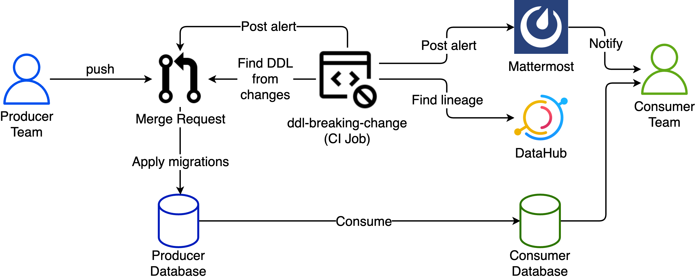

## Disclaimer
The code will be published later. 

# DDL Breaking Change Application Documentation

## Description

The `ddl-breaking-change` application identifies potential breaking changes in SQL migrations that might impact downstream consumer scripts (ClickHouse, Greenplum, Tableau, Metabase, etc.). It analyzes changes in Merge Requests, detects specific DDL commands (e.g., `DROP COLUMN`, `RENAME COLUMN`), and sends notifications to GitLab and Mattermost.

To provide precise information about potentially affected consumers, **the application leverages the DataHub platform**. It utilizes DataHub's API to retrieve a list of dependent tables and columns for every detected breaking change. This integration ensures that the notifications sent are relevant and targeted, allowing downstream teams to take appropriate action.

## Diagram

## Workflow

1. **Producer Team** modifies the Operational microservice code, including DDL migrations, and creates a Merge Request (MR) in the repository.
2. Upon MR creation, a **GitLab CI Job (ddl-breaking-change)** analyzes the MR's changes for potential DDL breaking changes.
3. The **CI Job** consults a local **SQLite database** to check if identical DDL breaking changes were detected in previous commits.
4. If new DDL breaking changes are found, the **CI Job** queries **DataHub's API** to identify dependent tables and columns impacted by the changes.
5. Using the information from DataHub, the **CI Job** sends notifications (alerts) to the designated **Mattermost alert channel**, specifying the affected tables and columns, notifying their Owners on the Consumer side.
6. The **CI Job** also adds a comment to the MR commit, detailing the detected DDL breaking changes and the downstream impact identified via DataHub. Depending on the configuration, the CI Job might block the MR or simply notify about potential issues.
7. The **CI Job** persists information about the detected DDL breaking changes in the local **SQLite database** to prevent duplicate notifications in the future.
8. After the MR is reviewed and approved, the DDL migrations are applied to the **Operational microservice database** using migration tools.
9. The **Consumer Team** analyzes the DDL breaking changes and updates their scripts if necessary to ensure compatibility with the new database changes.
10. The **Consumer Team**, utilizing data from the Operational database and whose scripts might be affected by DDL breaking changes, monitors new alerts in the designated **Mattermost alert channel** and adjusts their ingestion scripts, coordinating the timeline for changes.
